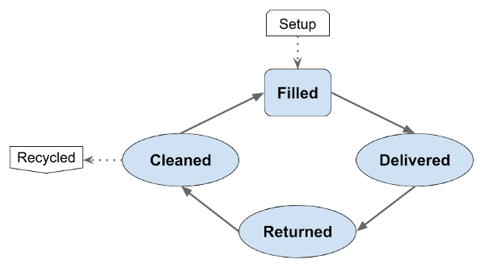

# Cycle

Defines the steps a piece of packaging progresses through in each reuse cycle.

## Summary

Reuse cycles are unique depending on the asset and the reuse model amongst other variables. Any reuse dataset should be fully self describing, including the reuse cycle itself.

The cycle is made up of "Activities" which mark the movement of the reusable asset through each step in the cycle. 

Each Activity can have one or more following Activities. These define how the reusable asset moves through the cycle. 

The data may include explicit activities for when an asset joins or leaves the reuse cycle.

Activity Types are used to facilitate comparison between cycles and to identify the "starting" activity which is used to count the number of times each individual asset moves through the cycle.

## Fields

### Cycle

Field Name | Data Type | Required | Description
---------- | --------- | -------- | -----------
|cycle_id|UUID|Yes|Unique identifier|
|name|String|No|Descriptive name|
|reuse_model|List|Yes|Type of reuse model. Single value from the "Reuse Model" codelist|
|activities|Array|Yes|Array of Activity objects, describing each step in the cycle|

### Activities

Field Name | Data Type | Required | Description
---------- | --------- | -------- | -----------
|activity_id|UUID|Yes|Unique identifier|
|activity_type|List|Yes|Single value from "Activity Type" codelist|
|name|String|Yes|Descriptive name|
|next|Array|No|Array of UUIDs referring to the zero, one or more activities within this cycle that directly follow this one. |
